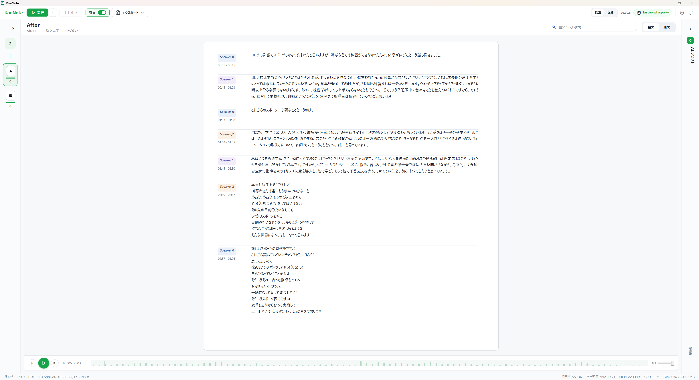

# KoeNote

KoeNote は、日本語音声ファイルをローカル PC 上で文字起こしし、必要に応じて整文・要約・エクスポートまで行える Windows アプリです。



## 最新 Release

最新版: v0.17.3

Download: [GitHub Releases](https://github.com/TommyKammy/KoeNote/releases/latest)

v0.17.3 では、カード見出しやヘッダーのアイコン表示を整え、UI の視認性を改善しました。

## 主な機能

- 音声ファイルの文字起こし
- 文字起こし結果の確認と編集
- 整文レビュー
- 要約
- 話者表示
- TXT / Markdown / JSON / SRT / VTT / DOCX 形式でのエクスポート
- Setup Wizard によるモデル・runtime 導入
- GitHub Releases 経由の更新確認

## 動作環境

### 対応 OS

- Windows 10 / Windows 11
- x64 環境

### 推奨ハードウェア

| 項目 | 最小目安 | 推奨 |
| --- | --- | --- |
| CPU | 4 コア以上 | 6-8 コア以上 |
| メモリ | 8GB 以上 | 16GB 以上 |
| ストレージ | 20GB 以上の空き容量 | 50GB 以上の空き容量 |
| GPU | 任意 | NVIDIA GPU / VRAM 6GB 以上 |

GPU は必須ではありません。GPU がない環境でも CPU 版 runtime で利用できます。

## 推奨プリセットの目安

KoeNote は、PC 性能に応じて ASR モデルと Review 用 LLM の組み合わせを選べます。迷った場合は Setup Wizard のおすすめ構成を使ってください。

| PC 構成 | おすすめプリセット |
| --- | --- |
| NVIDIA GPU なし + RAM 12GB 未満 | 超軽量 |
| NVIDIA GPU なし + RAM 12GB 以上、できれば CPU 6 コア以上 | 軽量 |
| NVIDIA GPU あり + VRAM 6GB 以上 | 推奨 |
| NVIDIA GPU あり + VRAM 8GB 以上 + RAM 24GB 以上 | 高精度 |

補足:

- GPU なしでも、RAM 12GB 以上かつ CPU 6 コア以上であれば「軽量」をおすすめします。
- GPU review runtime の導入に失敗しても、CPU 版で KoeNote 本体は利用できます。
- モデルや runtime は後から追加導入・変更できます。

## 精度改善の考え方

KoeNote は、小型 LLM でも実用的に使いやすくするために、辞書プリセットや整文レビューの結果を活用できます。

### 辞書プリセット

専門用語、人名、地名、固有名詞、よく使う言い回しなどを辞書プリセットとして登録できます。辞書プリセットは、ASR や Review 処理の補助情報として利用され、誤認識や不自然な表記を減らす助けになります。

### 整文レビューと履歴の蓄積

整文レビューや修正結果を通して、利用者ごとの表記傾向やドメイン語彙をデータベースに蓄積できます。これにより、大型 LLM を使わなくても、Bonsai 8B のような小型 LLM で一定の精度向上を狙えます。

特に以下のような用途で効果が期待できます。

- 固有名詞の表記ゆれを減らす
- 業界用語や専門用語を反映しやすくする
- 利用者ごとの好みの文体に近づける
- ASR 誤認識を後段の整文・要約で補正しやすくする

ただし、完全な自動学習ではなく、辞書プリセットやレビュー結果を補助情報として活用する設計です。重要な文章では、最終確認と編集を行ってください。

## セットアップ

初回起動時、またはヘッダーのセットアップアイコンから Setup Wizard を開けます。

Setup Wizard では、以下を確認・導入できます。

- 保存先
- ライセンス
- ASR モデル
- Review 用 LLM
- 話者識別 runtime
- GPU review runtime
- 導入内容の確認
- 動作確認

「おすすめで進める」を使うと、PC 構成に応じた構成を選びやすくなります。GPU runtime や話者識別 runtime の導入に失敗しても、KoeNote 本体や CPU 版整文を継続利用できます。

## 使い方

1. KoeNote を起動します。
2. ジョブ欄へ音声ファイルをドラッグ & ドロップします。
3. 必要に応じて、ヘッダーの整文 ON / 要約 ON を切り替えます。
4. 実行ボタンを押します。
5. 文字起こし、整文、要約の結果を確認します。
6. 必要に応じて編集します。
7. エクスポートメニューから形式を選んで出力します。

## 後から整文・要約を実行する

素起こし完了済みのジョブでは、実行ボタン横のメニューから以下を実行できます。

- 整文を実行
- 要約を実行
- 整文して要約を実行

ASR や音声変換は再実行せず、既存の文字起こし結果に対して後処理だけを実行します。

## 画面の見方

### ヘッダー

画面上部には、よく使う操作があります。

- 実行: 選択中のジョブを処理します。
- 実行メニュー: 素起こし完了済みジョブに対して、後から整文・要約を実行します。
- 中止: 実行中の処理を中止します。
- 整文 ON / OFF: 通常実行時の整文ステージを切り替えます。
- 要約 ON / OFF: 通常実行時の要約ステージを切り替えます。
- エクスポート: 文字起こし、整文、要約を指定形式で出力します。
- VERSION / ASR / 整文 / 要約: 現在のバージョンと利用中モデルを表示します。
- 設定 / セットアップ / モデル / ログ / 更新確認: 環境、モデル、ログ、アップデートを確認します。

### ジョブ

左側には、登録した音声ファイルが表示されます。

- 登録済み、実行中、整文待ち、完了などの状態を確認できます。
- ジョブごとに処理ステージが表示されます。
- 不要なジョブはクリア履歴へ移動できます。
- ジョブ欄下部のインポート領域から音声ファイルを追加できます。

### 文字起こし

中央には、文字起こし結果が表示されます。

- 音声の再生位置に合わせて内容を確認できます。
- セグメントをダブルクリックして本文を編集できます。
- 話者名をクリックして編集できます。
- 自動スクロールを有効にすると、再生位置に近いセグメントへ追従します。

### 整文・要約

右側には、整文結果と要約が表示されます。

- 整文レビューにより、文字起こし結果をより自然な文章へ整えます。
- 要約 ON の場合、文字起こしまたは整文結果から要約を生成します。
- ASR 結果が短い、または内容が不自然な場合、整文・要約の品質も影響を受けることがあります。

### 処理ステージと再生バー

画面下部には、処理ステージと音声再生バーがあります。

- 音声変換
- ASR
- 整文
- 要約

各ステージの状態を見ながら、音声を再生・停止・シークできます。

## モデル管理

ヘッダーのモデルアイコンから、文字起こしや整文・要約に使うモデルを確認できます。

- インストール済みモデルの確認
- 使用するモデルの切り替え
- モデルファイルの削除
- ライセンス確認
- GPU review runtime や話者識別 runtime の追加導入

モデルファイルは容量が大きい場合があります。不要なモデルは削除することで PC の空き容量を増やせます。

## エクスポート形式

KoeNote は以下の形式で出力できます。

- TXT
- Markdown
- JSON
- SRT
- VTT
- DOCX

字幕用途では SRT / VTT、文章として確認・共有する場合は TXT / Markdown / DOCX が便利です。

## データ保存場所

KoeNote のデータは主に以下に保存されます。

```text
%APPDATA%\KoeNote
%LOCALAPPDATA%\KoeNote
```

ログはアプリ内のログ画面から確認できます。

## 更新

KoeNote は GitHub Releases の情報を使って更新確認を行います。ヘッダーの更新確認アイコンから、現在のバージョンが最新版かどうかを確認できます。

更新メタデータ:

```text
https://tommykammy.github.io/KoeNote/latest.json
```

現在の MSI は未署名です。インストール時に Windows Defender SmartScreen の警告が表示される場合があります。

## ライセンス

KoeNote 本体は Apache License 2.0 で提供されます。

利用する外部ライブラリ、runtime、モデルにはそれぞれ個別のライセンスがあります。詳しくは `distribution/license-manifest.json` を確認してください。
