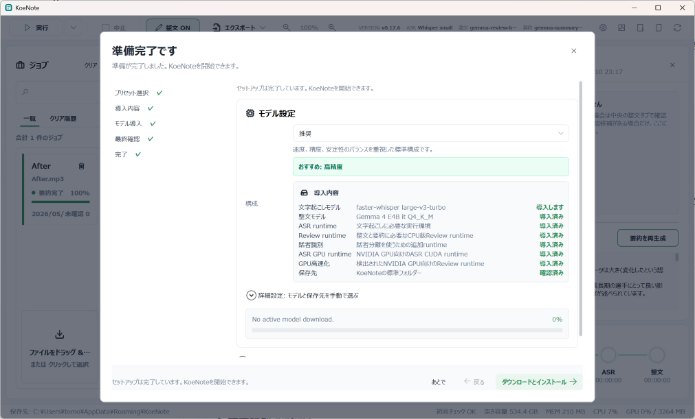
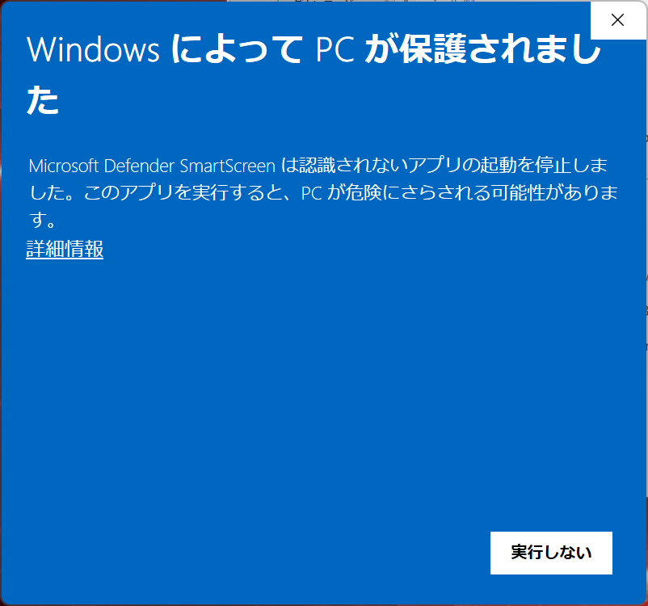

# KoeNote

KoeNote は、日本語音声ファイルから読みやすい文書をローカル PC 上で作成する Windows アプリです。音声変換、文字起こし、話者識別、整文、要約、エクスポートまでを一つの画面で扱えます。


## ユースケース

KoeNote は、会議、インタビュー、面談、研究、医療・福祉・教育・法務など、外部サービスへ渡しにくい音声データを扱う場面を想定しています。音声ファイルをクラウド事業者へアップロードせず、ローカル PC 上の ASR モデルと LLM で文字起こし、整文、要約まで完結できるため、センシティブな情報を手元の環境に留めたまま処理できます。

特に、以下のような利用者に向いています。

- 個人情報、未公開情報、業務上の機密を含む音声を扱う人
- クラウド文字起こしサービスへ音声ファイルを送信したくない人
- 組織のセキュリティポリシー上、外部 AI サービスの利用に制約がある人
- 日本語音声を文字起こしした後、読みやすい文章や要約まで一つのアプリで作りたい人

## 主な機能

- 音声ファイルの文字起こしと話者識別
- 読みやすい文書としての整文生成
- 素起こし、整文、差分、レビュー候補の確認
- 素起こし結果の確認・修正と再整文
- 要約の生成・再生成
- TXT / Markdown / JSON / SRT / VTT / DOCX / XLSX 形式でのエクスポート
- Setup Wizard によるモデル・runtime 一括導入
- GitHub Releases 経由の更新確認

## 動作環境

### 対応 OS

- Windows 10 / Windows 11
- x64 環境

### 推奨ハードウェア

| 項目 | 最小目安 | 推奨 |
| --- | --- | --- |
| CPU | 4 コア以上 | 6-8 コア以上 |
| メモリ | 8GB 以上 | 16GB 以上 |
| ストレージ | 20GB 以上の空き容量 | 50GB 以上の空き容量 |
| GPU | 任意 | NVIDIA GPU / VRAM 6GB 以上 |

GPU は必須ではありません。GPU がない環境でも CPU 版 runtime で利用できます。

## 推奨プリセットの目安

KoeNote は、PC 性能に応じて ASR モデルと Review 用 LLM の組み合わせを選べます。迷った場合は Setup Wizard のおすすめ構成を使ってください。

| PC 構成 | おすすめプリセット | ASR モデル | Review 用 LLM |
| --- | --- | --- | --- |
| NVIDIA GPU なし + RAM 12GB 未満 | 超軽量 | Whisper base | Bonsai 8B Q1_0 |
| NVIDIA GPU なし + RAM 12GB 以上、できれば CPU 6 コア以上 | 軽量 | Whisper small | Bonsai 8B Q1_0 |
| NVIDIA GPU あり + VRAM 6GB 以上 | 推奨 | faster-whisper large-v3-turbo | Gemma 4 E4B it Q4_K_M |
| NVIDIA GPU あり + VRAM 8GB 以上 + RAM 24GB 以上 | 高精度 | faster-whisper large-v3 | Gemma 4 E4B it Q4_K_M |

補足:

- GPU なしでも、RAM 12GB 以上かつ CPU 6 コア以上であれば「軽量」をおすすめします。
- 必要 runtime は Setup Wizard の一括導入でまとめて導入します。NVIDIA GPU 向け runtime が必要な構成では、導入状態を確認しながら再試行できます。
- モデルや runtime は後から追加導入・変更できます。
- 表のモデル名は `src/KoeNote.App/catalog/model-catalog.json` のプリセット定義に基づきます。

## 精度改善の考え方

KoeNote は、小型 LLM でも実用的に使いやすくするために、辞書プリセットや整文候補・修正結果を活用できます。

### 辞書プリセット

専門用語、人名、地名、固有名詞、よく使う言い回しなどを辞書プリセットとして登録できます。辞書プリセットは、ASR や整文処理の補助情報として利用され、誤認識や不自然な表記を減らす助けになります。

### 整文候補と履歴の蓄積

整文候補や修正結果を通して、利用者ごとの表記傾向やドメイン語彙をデータベースに蓄積できます。これにより、大型 LLM を使わなくても、Bonsai 8B のような小型 LLM で一定の精度向上を狙えます。

特に以下のような用途で効果が期待できます。

- 固有名詞の表記ゆれを減らす
- 業界用語や専門用語を反映しやすくする
- 利用者ごとの好みの文体に近づける
- ASR 誤認識を後段の整文・要約で補正しやすくする

ただし、完全な自動学習ではなく、辞書プリセットやレビュー結果を補助情報として活用する設計です。重要な文章では、最終確認と編集を行ってください。

## セットアップ

初回起動時、またはヘッダーのセットアップアイコンから Setup Wizard を開けます。

現在の Setup Wizard は、PC 構成に合わせたプリセットを選び、導入内容を確認してから必要なモデルや runtime をまとめて導入する流れです。左側のステップは、`プリセット選択`、`導入内容`、`モデル導入`、`最終確認`、`完了` の順に進みます。



Setup Wizard では、以下を確認・実行できます。

- PC 構成に応じたおすすめプリセットの確認
- ASR モデル、整文 LLM、話者識別 runtime、ASR GPU runtime、GPU review runtime の導入内容プレビュー
- モデル保存先の確認
- 必要なライセンスの確認
- 未導入のモデルや runtime の一括ダウンロードとインストール
- 導入後の最終確認

通常はおすすめプリセットのまま進めれば使い始められます。モデルや保存先を手動で選びたい場合は、Setup Wizard 内の「詳細設定: モデルと保存先を手動で選ぶ」から変更できます。KoeNote 本体の動作に必要な runtime と、NVIDIA GPU 高速化に必要な runtime は区別して表示されます。必要 runtime が未導入の場合は、最終確認前に Wizard から再試行してください。

## 使い方

1. KoeNote を起動します。
2. ジョブ欄へ音声ファイルをドラッグ & ドロップします。
3. 必要に応じて、ヘッダーの整文 ON / OFF を切り替えます。
4. 実行ボタンを押します。
5. 文字起こしカードの `整文` タブで、読みやすい文書としての結果を確認します。
6. 必要に応じて、`素起こし` タブで原文を修正したり、右側の整文候補・要約を確認します。
7. エクスポートメニューから形式を選んで出力します。

## 後から整文・要約を実行する

素起こし完了済みのジョブでは、実行ボタン横のメニューから以下を実行できます。

- レビュー候補を生成
- 整文を生成
- 要約を実行

ASR や音声変換は再実行せず、既存の文字起こし結果に対して後処理だけを実行します。

## 画面の見方

### ヘッダー

画面上部には、よく使う操作があります。

- 実行: 選択中のジョブを処理します。
- 実行メニュー: 素起こし完了済みジョブに対して、後からレビュー候補、整文、要約を実行します。
- 中止: 実行中の処理を中止します。
- 整文 ON / OFF: 通常実行時に、ASR 後の整文ステージを実行するか切り替えます。
- エクスポート: 整文、素起こし、レビュー候補、要約を TXT / Markdown / JSON / SRT / VTT / DOCX / XLSX などの形式で出力します。タイムスタンプの有無や、同じ話者が連続するセグメントをまとめるかどうかも切り替えられます。
- ズーム: 文字起こしカード内のコンテンツ表示倍率を調整します。
- VERSION / ASR モデル: 現在のバージョンと、文字起こしに使うモデルを表示します。
- 設定 / 更新確認: 右上のアイコンから、設定・辞書プリセット・モデル・セットアップ・ログや更新確認を開けます。

### ジョブ

左側には、登録した音声ファイルが表示されます。

- 登録済み、実行中、整文待ち、完了などの状態を確認できます。
- ジョブごとに現在の状態と進捗率が表示されます。
- 不要なジョブはクリア履歴へ移動できます。
- ジョブ欄下部の `ファイルをドロップ / またはクリックして選択` から音声ファイルを追加できます。

### 文字起こし

中央には、文字起こしカードが表示されます。最初に見るタブは、読みやすい文書としての `整文` です。

- `整文`: 読みやすい文書として整えた結果を確認します。
- `素起こし`: ASR の原文を確認・修正できます。修正後は `再整文` できます。
- `差分`: 素起こしと整文の違いを確認します。
- `レビュー候補`: 整文前の候補を確認します。
- 話者フィルター、検索、自動スクロール、音声再生位置との連動を使って内容を確認できます。

### 整文候補・要約

右側には、整文候補と要約が表示されます。

- 整文候補では、整文結果に違和感がある場合に候補を確認できます。
- 要約エリアでは、整文または素起こしから要約を生成・再生成できます。
- ASR 結果が短い、または内容が不自然な場合、整文・要約の品質も影響を受けることがあります。

### 進捗と再生バー

ジョブカードには、現在の処理状態と進捗率が表示されます。処理は主に以下の順で進みます。

- 音声変換
- 素起こし
- 話者識別
- レビュー候補
- 整文

整文を OFF にしている場合、整文ステージはスキップとして扱われます。要約は右側の要約エリアから生成・再生成でき、素起こし完了後は実行メニューから後から実行できます。

画面下部の再生バーでは、音声ファイル名、再生位置、前後セグメントへの移動、再生・停止、波形シーク、音量、再生速度を操作できます。最下部のステータスバーには、保存先、初回チェック、空き容量、メモリ、CPU、GPU の状態が表示されます。

## モデル管理

右上の設定アイコンから詳細パネルを開き、文字起こしや整文・要約に使うモデルを確認できます。詳細パネルには、設定、辞書プリセット、モデル、セットアップ、ログのタブがあります。

- インストール済みモデルの確認
- 使用するモデルの切り替え
- 読みやすく整文プロンプトのモデル別カスタマイズ
- 辞書プリセットの管理
- モデルファイルの削除
- ライセンス確認
- ASR GPU runtime、GPU review runtime、話者識別 runtime の追加導入

モデルファイルは容量が大きい場合があります。不要なモデルは削除することで PC の空き容量を増やせます。

## エクスポート形式

KoeNote は、エクスポートメニューから出力対象ごとに形式を選べます。

- 整文: TXT / Markdown / DOCX / XLSX
- 素起こし: TXT / Markdown / JSON / SRT / VTT / DOCX / XLSX
- レビュー候補: TXT / Markdown / DOCX / XLSX
- 要約: Markdown / TXT

必要に応じて、エクスポートメニューでタイムスタンプを含めるかどうかも切り替えられます。字幕用途では SRT / VTT、文章として確認・共有する場合は TXT / Markdown / DOCX が便利です。XLSX は開始時刻、終了時刻、話者、本文を列分けして出力するため、Excel での確認・共有・編集に向いています。

`同じ話者をまとめる` をオンにすると、XLSX / TXT / Markdown / DOCX の出力では、連続する同じ話者のセグメントを 1 つにまとめます。開始時刻は先頭セグメント、終了時刻は末尾セグメントを使い、本文は改行区切りで連結されます。JSON / SRT / VTT は構造データや字幕としての時間精度を優先するため、このオプションの対象外です。

## データ保存場所

KoeNote のデータは主に以下に保存されます。

```text
%APPDATA%\KoeNote
%LOCALAPPDATA%\KoeNote
```

ログはアプリ内のログタブから確認できます。必要に応じて、ログフォルダを開いたり、診断パッケージとして出力したりできます。

## 更新

KoeNote は GitHub Releases の情報を使って更新確認を行います。ヘッダーの更新確認アイコンから、現在のバージョンが最新版かどうかを確認できます。

更新メタデータ:

```text
https://tommykammy.github.io/KoeNote/latest.json
```

### Microsoft Defender SmartScreen の警告

現在の MSI は未署名です。インストール時に Microsoft Defender SmartScreen の警告が表示される場合があります。



この画面が表示された場合は、`詳細情報` をクリックし、表示される `実行` ボタンを押すとインストールを続行できます。念のため、ダウンロード元が [KoeNote の GitHub Releases](https://github.com/TommyKammy/KoeNote/releases) であることを確認してください。

## ライセンス

KoeNote 本体は Apache License 2.0 で提供されます。

利用する外部ライブラリ、runtime、モデルにはそれぞれ個別のライセンスがあります。詳しくは `distribution/license-manifest.json` を確認してください。
